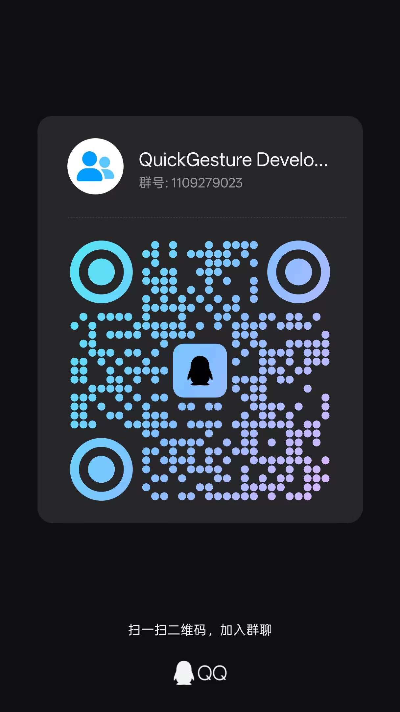

# QuickGesture of JavaScript

A Web Component Library for Gesture Interaction with Comprehensive Gesture Recognition APIs.

##  Catalogue

- [功能特性](#-功能特性)
- [快速开始](#-快速开始)
- [项目结构](#-项目结构)
- [使用示例](#-使用示例)
- [贡献指南](#-贡献指南)
- [许可证](#-许可证)
- [More](#-more)

##  More

Share your ideas or ask for help please join the group.

